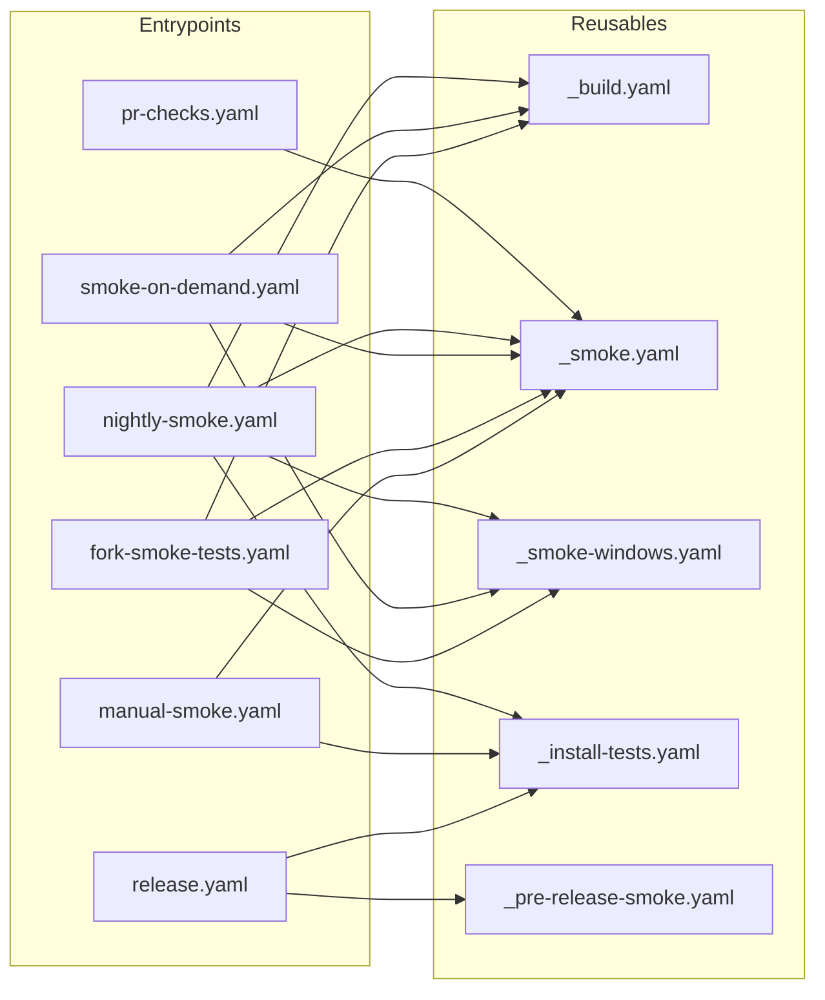
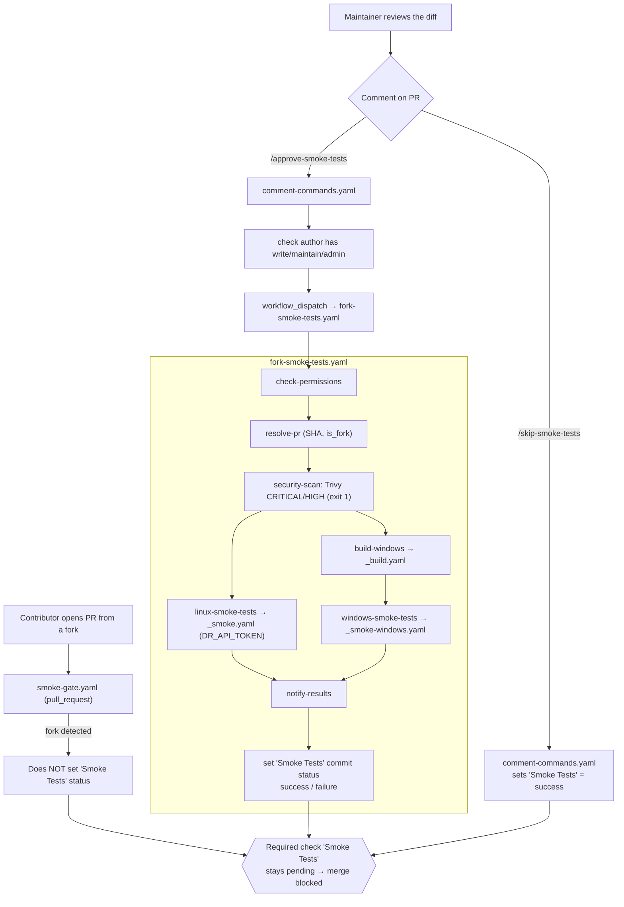

# GitHub Actions Workflows

This directory holds the CI/CD workflows for the DR CLI. GitHub Actions does not
support subdirectories here — every workflow lives flat — so files are grouped by
a **naming convention** instead, and repeated *step* logic lives in composite
actions under [`.github/actions/`](../actions/).

## Naming convention

| Prefix | Kind | Trigger | Sorts as |
| --- | --- | --- | --- |
| `_` | **Reusable** building block | `workflow_call` only | grouped at top |
| `pr-` | **PR entrypoint** | `pull_request` | grouped together |
| `manual-` | **Manual entrypoint** | `workflow_dispatch` | grouped together |
| none | **Event entrypoint** | push / schedule / tag | — |

> **Important: reusable workflows must use the full repo path.**
>
> In top-level workflows (e.g. `checks.yaml`), reference composite actions with
> the local path: `./.github/actions/setup`. In **reusable workflows** (those
> with `on: workflow_call`), use the full repo path instead:
> `datarobot-oss/cli/.github/actions/setup@main`.
>
> GitHub resolves `uses:` paths **before** `actions/checkout` runs, so local
> paths (`./`) don't work in reusable workflows — the `.github/actions/`
> directory isn't populated yet. This is a known GitHub Actions limitation
> ([community discussion #18601](https://github.com/orgs/community/discussions/18601)).
>
> We use `@main` rather than pinning to a SHA because these are internal
> same-repo utility actions. SHA pinning creates a chicken-and-egg problem:
> you can't know the new SHA until the change merges to `main`, so PR CI would
> test against the old version. The GitHub Actions Team is developing a native
> `$/` syntax ([discussion #26245](https://github.com/orgs/community/discussions/26245))
> to resolve same-repo actions at the same SHA automatically, but it hasn't
> shipped yet.

One extension everywhere: **`.yaml`**.

## File index

**Reusables (`_*.yaml`)** — called by entrypoints, never triggered directly:

| File | Purpose |
| --- | --- |
| `_build.yaml` | Cross-compile all targets on Ubuntu via GoReleaser; uploads the Windows binary artifact. |
| `_smoke.yaml` | Parameterized smoke-test scaffold. Caller picks prep steps (`install-deps`, `setup`, `install-bin`, `build`, `needs-token`, `debug-brew`) and passes the command via `test-script`. |
| `_smoke-windows.yaml` | Windows smoke tests against a downloaded prebuilt binary artifact. |
| `_install-tests.yaml` | Installation-script tests across Linux/macOS/Windows. |
| `_pre-release-smoke.yaml` | Heavier end-to-end smoke tests that gate release promotion. |

**Entrypoints:**

| File | Trigger | Purpose |
| --- | --- | --- |
| `pr-checks.yaml` | `pull_request → main` | Lint, test, copyright, code-gen, cross-compile build, auto-label; conditional deps/install/completion tests. |
| `pr-security.yaml` | `pull_request`, `push → main` | Trivy scan, govulncheck, dependency-review, CodeQL (Go) analysis (`analyze` job, non-blocking until Phase 5). |
| `smoke-gate.yaml` | `pull_request → main` | Sets the required **Smoke Tests** commit status (see below). |
| `smoke-on-demand.yaml` | `pull_request [labeled]` | Label-triggered smoke tests for **non-fork** PRs. |
| `comment-commands.yaml` | `issue_comment` | Slash-commands (trigger/approve/skip smoke & install tests). |
| `fork-smoke-tests.yaml` | `workflow_dispatch` | Maintainer-approved fork smoke tests with a security pre-scan. |
| `manual-smoke.yaml` | `workflow_dispatch` | Manual deps / install-integration / installation smoke suites (`suite` input). |
| `nightly-smoke.yaml` | `push → main`, `schedule`, `dispatch` | Full smoke matrix + install/self-update tests + Slack on failure. |
| `release.yaml` | `push tags v*` | GoReleaser release → verify-installation → pre-release smoke → promote. |
| `dev-image.yaml` | `push → main`, `dispatch` | Build and push a floating multi-arch `ghcr.io/datarobot-oss/cli:dev` Docker image. |
| `image-on-pr-approval.yaml` | `pull_request_review [submitted]` | When a maintainer approves a PR, build and push a per-PR multi-arch image (`pr-<n>` / `pr-<n>-<sha>`) to GHCR and set a `PR Image` commit status with the image name. |
| `pages.yaml` | `push → main`, `dispatch` | Build and deploy the MkDocs site to GitHub Pages. |

## Composite actions

Step-level building blocks under [`.github/actions/`](../actions/). They run in
the caller's job, so the repo must be checked out **before** they are used.

- **`setup`** — Go (version from `go.mod` via `go-version-file`) + optional
  Taskfile, with `setup-go`'s built-in module/build caching. Inputs: `cache`,
  `install-task`.
- **`install-deps`** — OS-aware install of `expect`, `bash-completion`, and `yq`.
- **`install-dr-bin`** — build `dr`, install via `install.sh`, add `~/.local/bin`
  to PATH (Unix only).

## Flow diagrams

How the entrypoints wire to the reusables, plus the fork-PR gate. Full per-flow
diagrams (regular PR, on-demand / nightly / manual smoke, release, pages) live in
[`docs/development/ci-workflow-flows.md`](../../docs/development/ci-workflow-flows.md).

**Entrypoints → reusable building blocks:**

**Forked PR (the `Smoke Tests` gate):**

## The `Smoke Tests` required check

`smoke-gate.yaml` sets a hand-rolled **`Smoke Tests`** commit status (the exact
string is a branch-protection required check):

- **Non-fork PRs** — auto-set to `success` (smoke tests are opt-in via labels/commands).
- **Fork PRs** — the status is *not* set; the missing required check blocks merge
  until a maintainer runs or skips the tests.

> ⚠️ The `Smoke Tests` context string is set by name in a script, so it is immune
> to file renames. Keep it unchanged, and update branch-protection required-check
> names in lockstep with any job/workflow rename, or fork PRs will hang.

## PR automation: commands & labels

Slash-commands (comment on a PR — `comment-commands.yaml`):

- `/trigger-smoke-test` — run smoke tests on this PR (non-fork only).
- `/trigger-install-test` — run installation tests on this PR (non-fork only).
- `/approve-smoke-tests` (or `/approve-fork-tests`) — run fork smoke tests (maintainers).
- `/skip-smoke-tests` — mark the **Smoke Tests** check passed without running (maintainers).

Labels: `run-smoke-tests` or `go` trigger `smoke-on-demand.yaml` (non-fork PRs only).

### Forked PRs

Fork PRs use `workflow_dispatch` (never `pull_request_target`) to avoid secrets
leakage. A maintainer reviews the diff, then comments `/approve-smoke-tests` to
run a security pre-scan plus smoke tests (results update the **Smoke Tests**
status), or `/skip-smoke-tests` to bypass it. The `run-smoke-tests` label and
`/trigger-smoke-test` command do not work on fork PRs.

## Slack notifications

`release.yaml` (success + failure) and `nightly-smoke.yaml` (failure only) post to
Slack via the `SLACK_WEBHOOK_URL` repository secret.

## Conventions for editing

- Reusables only share whole jobs; share *steps* via composite actions instead.
- Set top-level `permissions: contents: read` and grant per-job minimums (S5).
- SHA-pin third-party actions with a `# vX.Y.Z` comment; Dependabot bumps them.
- `workflow_dispatch` run history does not carry across file renames.
