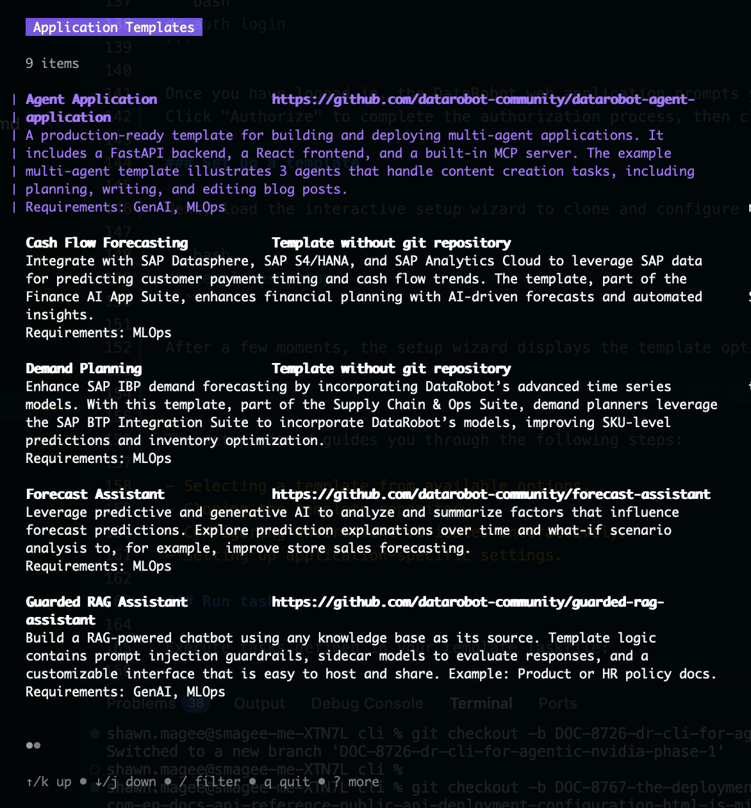

<p align="center">
  <a href="https://github.com/datarobot-community/datarobot-agent-templates">
    
  </a>
</p>
<p align="center">
    <span style="font-size: 1.5em; font-weight: bold; display: block;">DataRobot CLI</span>
</p>

<p align="center">
  <a href="https://datarobot.com">Homepage</a>
  ·
  <a href="https://docs.datarobot.com/">Documentation</a>
  ·
  <a href="https://docs.datarobot.com/en/docs/get-started/troubleshooting/general-help.html">Support</a>
</p>

<p align="center">
  <a href="https://github.com/datarobot-oss/cli/tags">
    
  </a>
  <a href="LICENSE.txt">
    
  </a>
</p>

# DataRobot CLI

[](https://goreportcard.com/report/github.com/datarobot/cli)
[](LICENSE.txt)

The DataRobot CLI (`dr`) is a command-line interface for managing DataRobot custom applications. It provides an interactive experience for cloning, configuring, and deploying DataRobot application templates with built-in authentication, environment configuration, and task execution capabilities.

## Features

- 🔐 **Authentication management**&mdash;seamless OAuth integration with DataRobot.
- 📦 **Template management**&mdash;clone and configure application templates interactively.
- ⚙️ **Interactive configuration**&mdash;smart wizard for environment setup with validation.
- 🚀 **Task runner**&mdash;execute application tasks with built-in Taskfile integration.
- 🐚 **Shell completions**&mdash;support for Bash, Zsh, Fish, and PowerShell.
- 🔄 **Self-update capability**&mdash;easily update to the latest version with a single command.
- 🎨 **Beautiful TUI**&mdash;terminal UI built with Bubble Tea for an enhanced user experience.

## Table of contents

- [Installation](#installation)
- [Quick start](#quick-start)
- [Next steps](#next-steps)
- [Contributing](#contributing)

## Installation

Install the latest version with a single command:

### macOS/Linux

```bash
curl https://cli.datarobot.com/install | sh
```

### Windows (PowerShell)

```powershell
irm https://cli.datarobot.com/winstall | iex
```

<details><summary><em>Alternative installation methods</em></summary>
<br/>
The following are alternative installation methods for the DataRobot CLI.
You can choose to install a specific version or build and install from source.

### Install specific version

If you'd like to install a specific version, you can do so by passing the version number to the installer, as shown below:

#### macOS/Linux

```bash
curl  https://cli.datarobot.com/install | sh -s -- v0.1.0
```

#### Windows (PowerShell)

```powershell
$env:VERSION = "v0.1.0"; irm https://cli.datarobot.com/winstall | iex
```

### Build and install from source

If you would like to build and install from source, you can do so by following the instructions below:

#### Prerequisites

- Go 1.25.3 or later (for building from source).
- Git.
- [Task](https://taskfile.dev/) (for development and task running).

#### Build from source

```bash
curl https://cli.datarobot.com/install | sh -s -- v0.1.0
```

#### Windows (Specific Version)

```powershell
$env:VERSION = "v0.1.0"; irm https://cli.datarobot.com/winstall | iex
```

</details>

## Quick start

Now that you have installed the DataRobot CLI, you can start using it to manage your DataRobot applications.
The following sections will walk you through configuring the CLI, setting up a template, and running tasks.

### Set up authentication

First, configure your DataRobot credentials by setting your DataRobot URL.
Refer to [DataRobot's API keys and tools page](https://docs.datarobot.com/en/docs/platform/acct-settings/api-key-mgmt.html) for steps to locate your DataRobot URL, also known as your DataRobot API endpoint.

```bash
# Set your DataRobot URL (interactive)
dr auth set-url # Or specify directly: dr auth set-url [YOUR_DATAROBOT_API_ENDPOINT]
```

Once you have configured the URL, log in to DataRobot. This command will open your default web browser to the DataRobot login page.

```bash
dr auth login
```

Once you have logged in, the DataRobot web application prompts you to authorize the CLI.
Click "Authorize" to complete the authorization process, then close the browser window once it is complete.

### Set up a template

Next, load the interactive setup wizard to clone and configure a template:

```bash
dr templates setup
```

After a few moments, the setup wizard displays the application templates available:



> [!NOTE]
> You can navigate through the list of templates using the arrow keys, or filter by pressing the `/` key and entering a search term. The setup wizard will only display templates that are available to you.

Select a template by pressing the `Enter` key.
At the subsequent prompt, specify the desired directory name for the template and press `Enter` to have the setup wizard clone the template repository to your local machine.

Follow the instructions when prompted to continue configuring the template.
The prompts vary depending on which template you selected.
When all steps are finished, press `Enter` to exit the wizard and proceed to the next section.

### Run tasks

Now that you've cloned and configured a template, you can start running tasks defined in the template Taskfile.
First, navigate to the template directory:

```bash
cd [TEMPLATE_NAME]
```

From there, you can list the available tasks:

```bash
dr run --list
```

## Next steps

From here, refer to the [Docs](/docs/) section of this repository for more details on using the DataRobot CLI.
See the links below for specific details:

- **[User guide](docs/user-guide/README.md)**&mdash;complete usage guide for all features.
  - [Getting started](docs/user-guide/getting-started.md)
  - [Authentication](docs/user-guide/authentication.md)
  - [Working with templates](docs/user-guide/templates.md)
  - [Shell completions](docs/user-guide/shell-completions.md)
  - [Configuration files](docs/user-guide/configuration.md)

- **[Template system](docs/template-system/)**&mdash;understanding the template configuration system.
  - [Template structure](docs/template-system/structure.md)
  - [Interactive configuration](docs/template-system/interactive-config.md)
  - [Environment variables](docs/template-system/environment-variables.md)

- **[Command reference](docs/commands/)**&mdash;detailed command documentation.
  - [auth](docs/commands/auth.md)&mdash;authentication commands.
  - [templates](docs/commands/templates.md)&mdash;template management.
  - [run](docs/commands/run.md)&mdash;task execution.
  - [dotenv](docs/commands/dotenv.md)&mdash;environment file management.
  - [completion](docs/commands/completion.md)&mdash;shell completion setup.

- **[Development guide](docs/development/)**&mdash;for contributors, see [CONTRIBUTING.md](CONTRIBUTING.md)

## Contributing

We welcome contributions! Please see [CONTRIBUTING.md](CONTRIBUTING.md) for details on:

- Code of conduct.
- Development workflow.
- Submitting pull requests.
- Coding standards.
- Testing requirements.

## Support

- 📖 [Documentation](docs/)
- 🐛 [Issue Tracker](https://github.com/datarobot/cli/issues)
- 💬 [Discussions](https://github.com/datarobot/cli/discussions)
- 📧 Email: <oss-community-management@datarobot.com>

## Acknowledgments

Built with:

- [Cobra](https://github.com/spf13/cobra)&mdash;CLI framework.
- [Bubble Tea](https://github.com/charmbracelet/bubbletea)&mdash;terminal UI framework.
- [Viper](https://github.com/spf13/viper)&mdash;configuration management.
- [Task](https://taskfile.dev/)&mdash;task runner.
