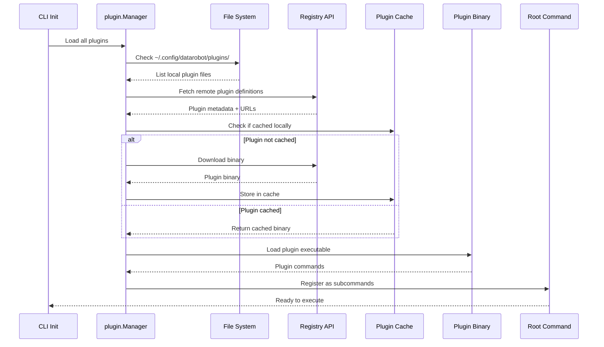
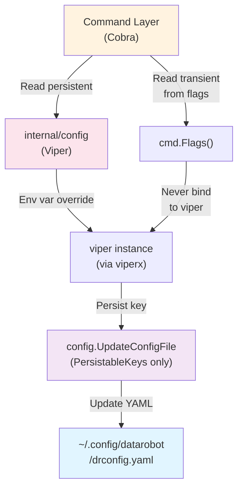
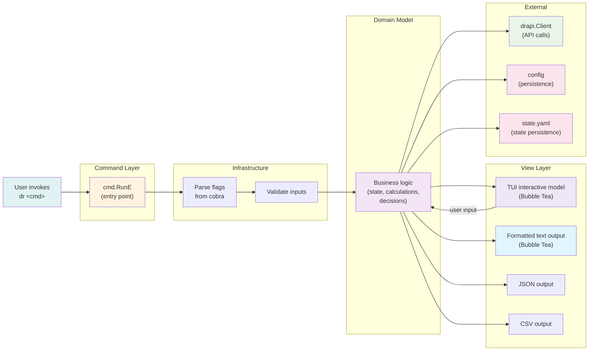
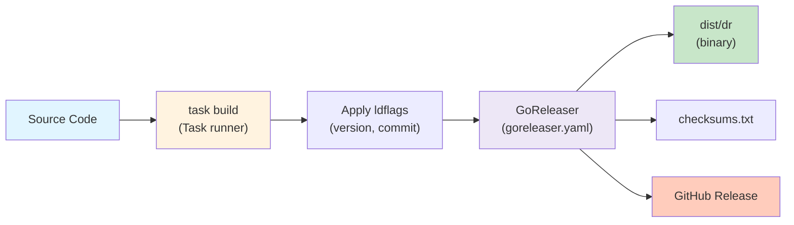

# Architecture

This document provides visual diagrams of the DataRobot CLI's key architectural patterns and data flows.

## Plugin loading

## Configuration flow

## Model-View-Cmd pattern for CLI commands

## Build and release

## Next steps

- [Project Structure](structure.md) - Detailed directory layout
- [Building & Development](building.md) - Build process and testing
- [Configuration Management](configuration.md) - Config files and flags
- [Authentication](authentication.md) - OAuth flow details
- [Plugins](plugins.md) - Plugin development guide
