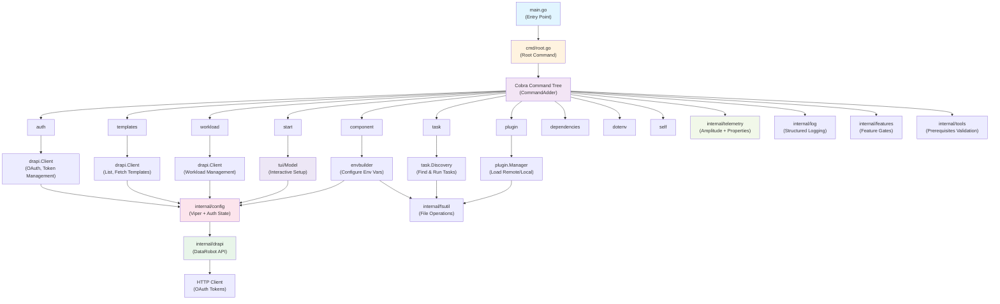
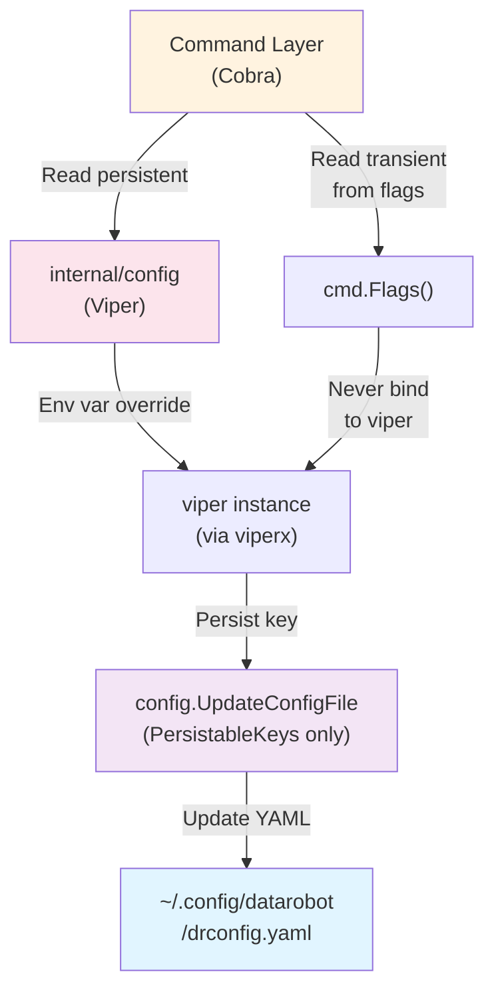
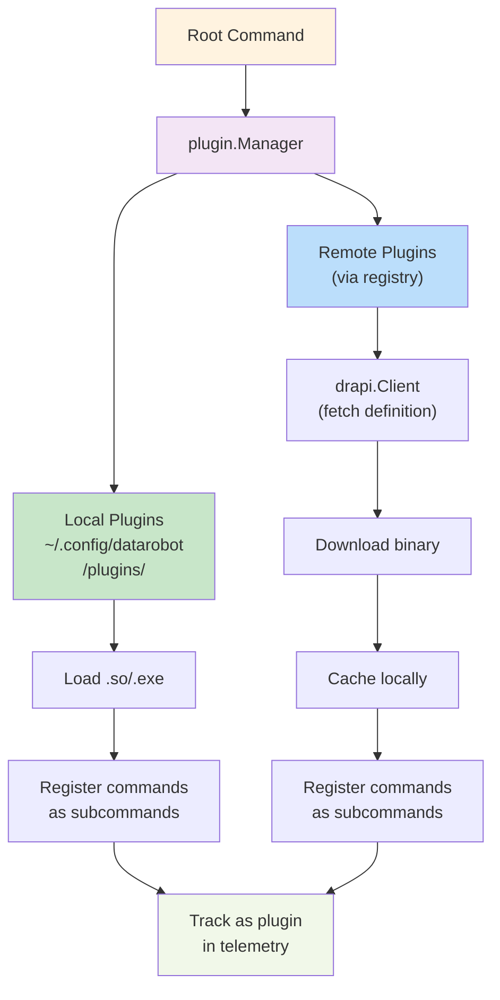
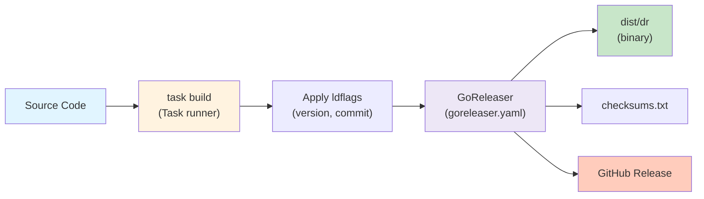

# Architecture

This document provides a visual and conceptual overview of the DataRobot CLI architecture.

## High-level architecture

## Detailed component layers

### 1. Command Layer (cmd/)

The CLI uses **Cobra** framework for command structure. The `CommandAdder` wraps the root command and intelligently filters child commands based on feature gates.

**Key commands:**
- **auth**: OAuth login/logout, token management
- **start**: Interactive project bootstrapping
- **templates**: Browse and fetch templates
- **component**: Manage AI components
- **task**: Execute Taskfile tasks
- **plugin**: Manage custom plugins (local and remote)
- **workload**: Deploy and manage workloads
- **dependencies**: Manage project dependencies
- **dotenv**: Manage environment configuration

### 2. Infrastructure Layer

#### Configuration (internal/config/)
- Manages `~/.config/datarobot/drconfig.yaml`
- Stores authentication tokens and user preferences
- Uses Viper for config management
- `viperx` wrapper prevents transient flags from persisting

#### DataRobot API Client (internal/drapi/)
- HTTP client for DataRobot API endpoints
- Handles OAuth token authentication
- Supports GET, POST, PATCH, DELETE operations
- Includes filesapi for file upload/download
- Provides LLM model listing

#### Telemetry (internal/telemetry/)
- Anonymous usage analytics via Amplitude
- Collects common properties (CLI version, OS, etc.)
- Distinguishes between core and plugin commands
- Respects user opt-out preferences

#### Logging (internal/log/)
- Structured logging with debug support
- `.dr-tui-debug.log` for TUI session logs
- Log levels controlled by `--debug` flag

#### Feature Gates (internal/features/)
- Enables/disables commands via `DATAROBOT_CLI_FEATURE_<NAME>` env vars
- Filtering happens at command registration time
- Allows experimental features without public visibility

### 3. Domain Layer

#### Authentication (cmd/auth/)
Uses OAuth 2.0 flow with platform-specific browser handling:
- `auth login`: Interactive OAuth setup
- `auth logout`: Remove cached tokens
- `auth status`: Check authentication state

#### Template System (cmd/templates/ + internal/copier/)
- Lists available AI application templates
- Copies templates to local environment
- Validates template structure
- Provides environment variable discovery

#### Environment Builder (internal/envbuilder/)
Discovers and configures environment variables:
- Reads template specs for required/optional vars
- Validates configuration against spec
- Generates `.env` files
- Provides interactive prompts

#### Task Execution (cmd/task/ + internal/task/)
- Detects Taskfile.yaml files
- Parses task definitions
- Runs tasks with proper context
- Captures and displays output

#### Plugin System (cmd/plugin/ + internal/plugin/)
- Loads plugins from `~/.config/datarobot/plugins/`
- Remote plugins via plugin registry
- Registers plugin commands as subcommands
- Isolated execution environment

#### Workload Management (cmd/workload/ + internal/workload/)
- Deploy custom applications to DataRobot
- Manage application versions
- Monitor workload status
- Handle application configuration

### 4. Utility Layer

#### File System (internal/fsutil/)
- Path resolution and validation
- File operations for safe copying
- Directory detection and creation

#### Repository Detection (internal/repo/)
- Identifies project root
- Validates repository structure
- Detects Taskfile presence

#### Shell Utilities (internal/shell/)
- Execute shell commands
- Capture output
- Handle cross-platform compatibility

#### Tool Prerequisites (internal/tools/)
- Validates required tools are installed
- Checks tool versions
- Provides installation guidance

### 5. User Interface Layer

#### Terminal UI (tui/)
Built with **Bubble Tea** framework:
- Interactive models for user input
- Interrupt handling for graceful Ctrl-C
- Banner and status displays
- Consistent styling via `tui/styles.go`
- Debug output to `.dr-tui-debug.log`

All TUI components are wrapped with `InterruptibleModel` and executed via `tui.Run()` for global Ctrl-C handling.

## Data flow: `dr start` example

```mermaid
graph LR
    A["User runs<br/>dr start"] --> B["Cobra parses<br/>arguments"]
    B --> C["Load config<br/>from drconfig.yaml"]
    C --> D{"Authenticated?"}
    D -->|No| E["Show auth prompt<br/>TUI Model"]
    E --> F["OAuth flow<br/>get token"]
    F --> G["Save token<br/>to config"]
    D -->|Yes| H["Show template<br/>selection TUI"]
    H --> I["User selects<br/>template"]
    I --> J["Fetch template<br/>via drapi.Client"]
    J --> K["Discover env vars<br/>from spec"]
    K --> L["Prompt for values<br/>TUI Model"]
    L --> M["Validate config<br/>vs spec"]
    M --> N["Copy template<br/>to project"]
    N --> O["Generate .env<br/>file"]
    O --> P["Send telemetry<br/>event"]
    P --> Q["Complete"]
    
    style A fill:#e1f5ff
    style Q fill:#c8e6c9
    style F fill:#ffccbc
    style J fill:#e8f5e9
    style P fill:#f1f8e9
```

## Configuration flow

## Plugin architecture

## Testing structure

Tests are colocated with source code:

- **Unit tests**: `*_test.go` files in the same package
- **Integration tests**: In `internal/` packages for cross-layer testing
- **Smoke tests**: In `smoke_test_scripts/` for end-to-end testing
- **Mocks**: Generated and defined in test files using testutil helpers

## Build and release

## Key design principles

1. **Feature Gates**: New commands can be hidden until release-ready via `DATAROBOT_CLI_FEATURE_<NAME>` env vars
2. **Command Naming**: All top-level commands use singular forms (e.g., `template` not `templates`) for consistency
3. **Configuration Safety**: Transient flags never persist; only explicitly listed keys in `PersistableKeys` are written
4. **Telemetry Privacy**: All telemetry is anonymized; users can opt-out via configuration
5. **Graceful Shutdown**: All TUI components use `InterruptibleModel` wrapper for consistent Ctrl-C handling
6. **OAuth Security**: Tokens are stored in local config file with file permissions; sensitive data never in URLs
7. **Plugin Isolation**: Plugins are loaded dynamically and tracked separately in telemetry
8. **Whitespace Compliance**: All code passes `golangci-lint` with strict whitespace requirements (WSL)

## Next steps

- [Project Structure](structure.md) - Detailed directory layout
- [Building & Development](building.md) - Build process and testing
- [Configuration Management](configuration.md) - Config files and flags
- [Authentication](authentication.md) - OAuth flow details
- [Plugins](plugins.md) - Plugin development guide
