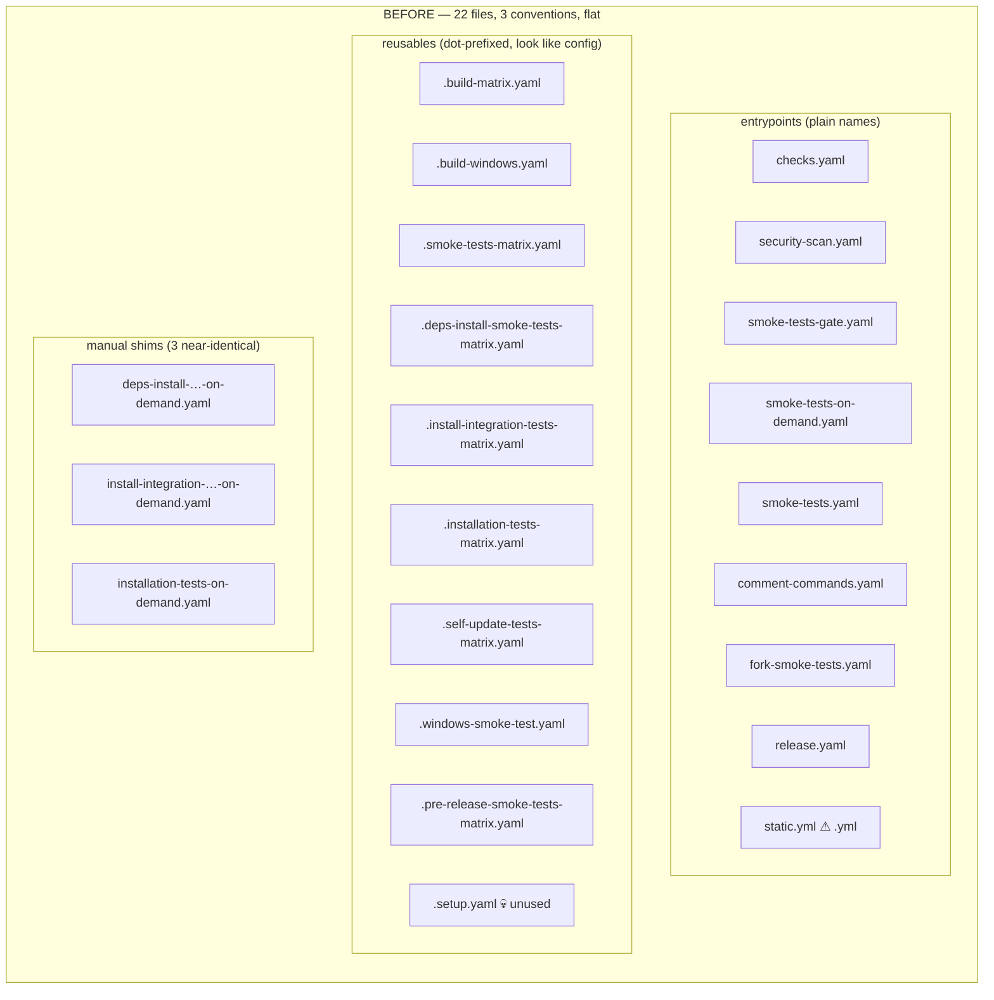
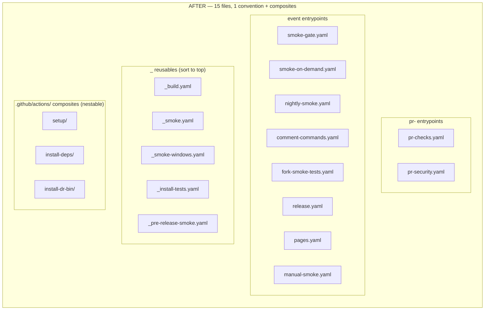
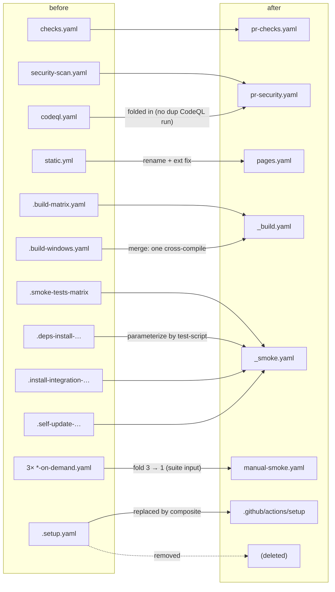
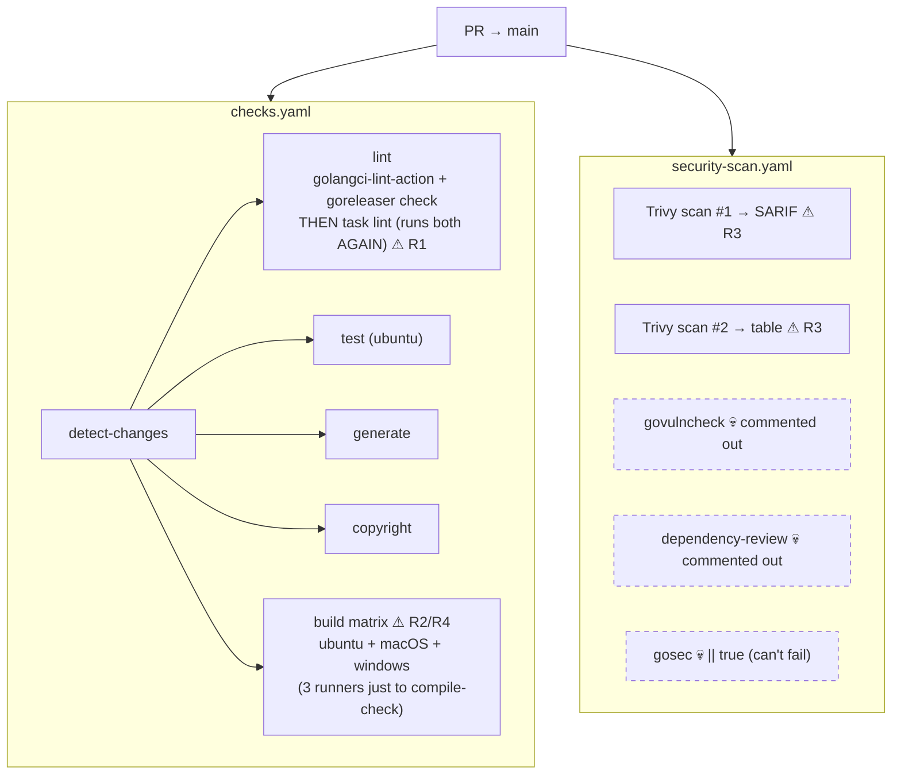
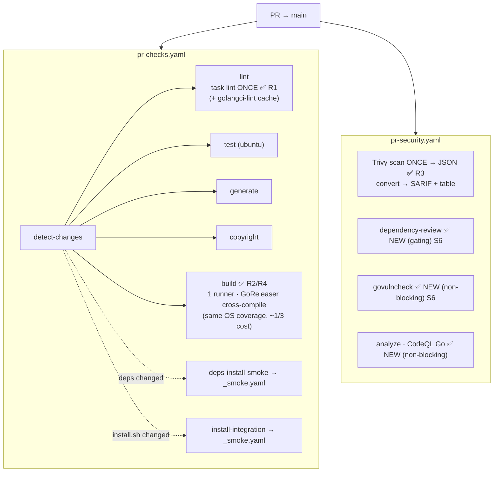
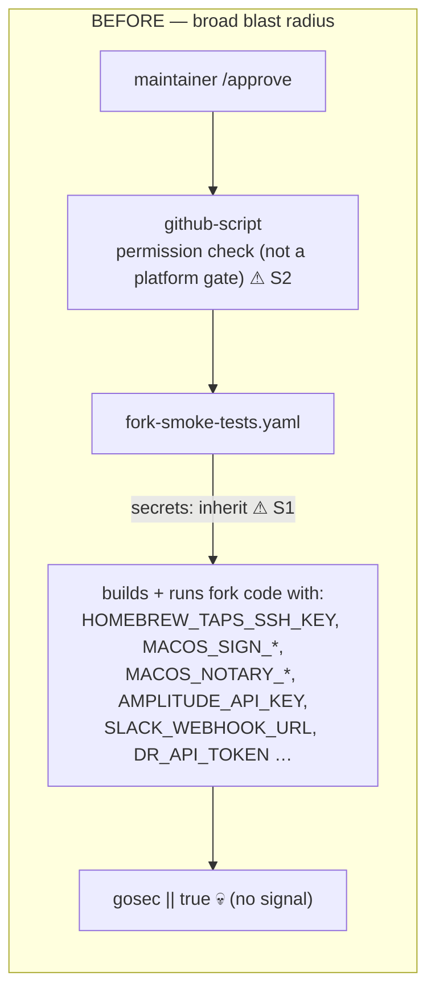
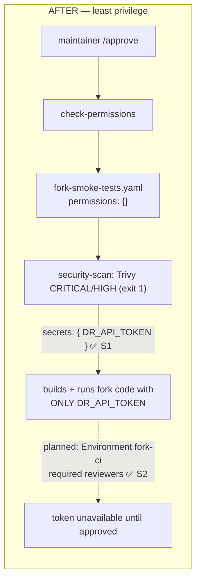
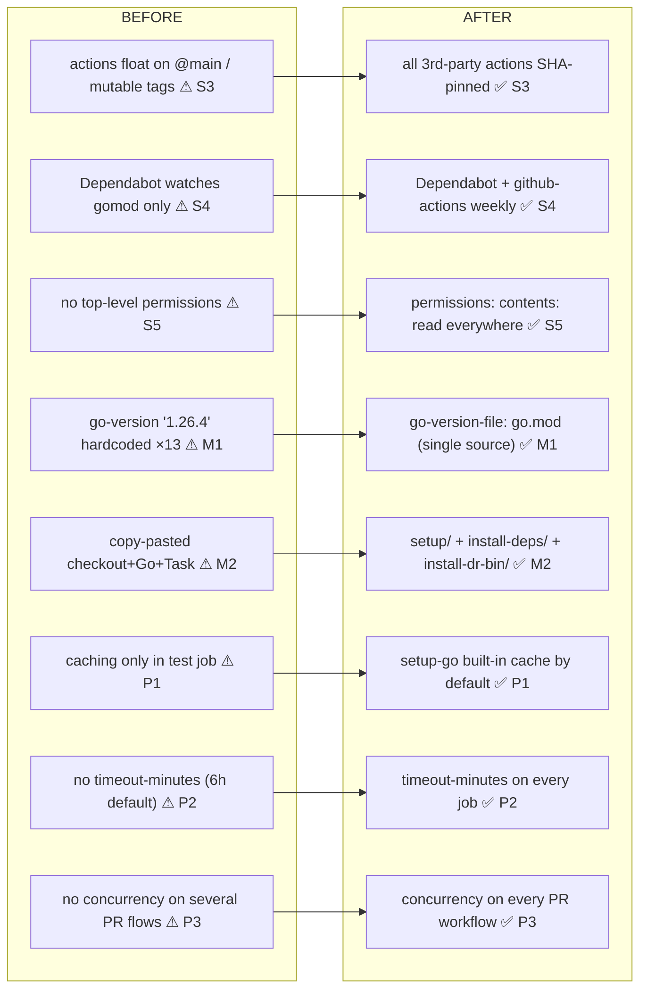
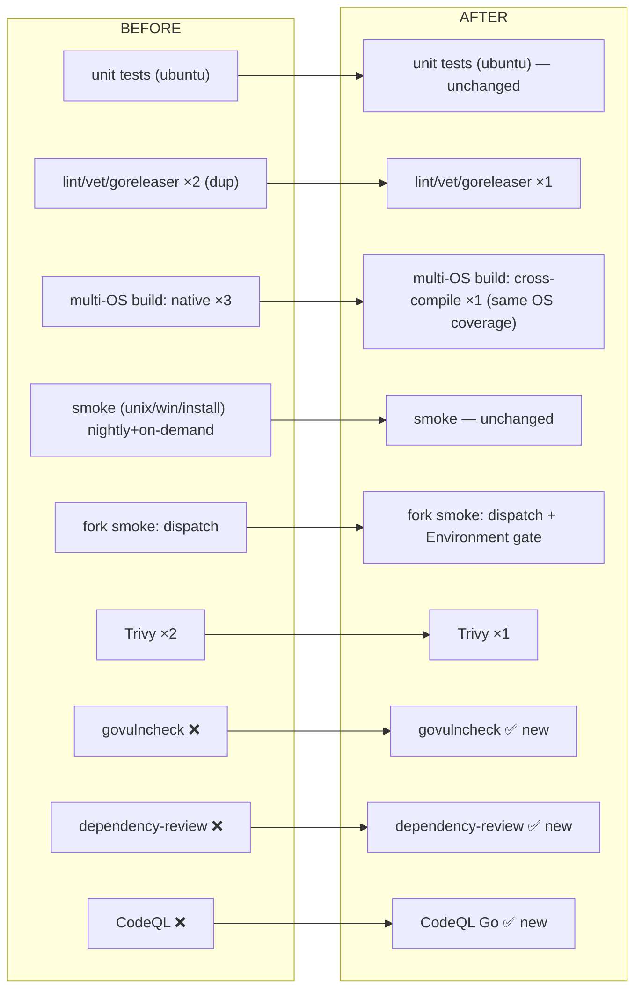

# CI/CD workflows: before → after

Companion to [`ci-workflow-flows.md`](./ci-workflow-flows.md) (which shows only the
final state) and [`ci-workflow-optimization-plan.md`](./ci-workflow-optimization-plan.md)
(which has the full rationale). This file shows the **whole CI side by side** — what it
looked like before the optimization work and what it looks like after all phases (0–4) —
so the changes can be read at a glance and justified as reasonable.

GitHub renders the Mermaid blocks natively; paste any pair into a PR description.

Finding IDs (`S1`, `R2`, `P3`, …) and phase tags map back to the optimization plan.

---

## 1. Topology — flat folder, before vs after

**Before:** 22 files sit flat in `.github/workflows/` under three competing naming
conventions, with no visual line between event-triggered *entrypoints* and
`workflow_call` *building blocks*. `.setup.yaml` is dead code; the README index drifts.

**After:** 15 files, one `.yaml` extension, grouped by a disciplined prefix convention
(`_` reusable · `pr-` PR entrypoint · `manual-` dispatch · bare verb-noun for
push/schedule/tag). Repeated *step* logic moved into composite actions under
`.github/actions/` (which **can** nest — workflows cannot). `~22 → ~15 files`.

### File-level migration (what merged into what)

---

## 2. PR pipeline — before vs after

The everyday path: a contributor opens a PR. This is where the **redundancy** and
**security-coverage** changes show up most clearly.

**Before** — lint and the build matrix do duplicate work, Trivy scans twice, and the only
security signal is a report-only Trivy plus dead/commented scanners.

**After** — lint runs once (single source of truth `task lint`), the build is one Ubuntu
cross-compile, Trivy scans once and reformats, and three real security checks are live.
Every job shares the `setup/` composite, has a `timeout-minutes`, and the workflow has
concurrency cancellation.

---

## 3. Fork-PR secrets — before vs after (the highest-value security change)

Fork PRs run untrusted code. The before path handed that code **every repo secret** via
`secrets: inherit`, gated only by a script-based permission check. The after path passes
**only `DR_API_TOKEN`** and (planned) puts it behind a GitHub Environment so the token is
physically unavailable until a reviewer approves.

---

## 4. Cross-cutting changes (apply to most/all workflows)

These don't change the *shape* of any one flow but harden every file. Shown as a
before → after ledger rather than a graph.

---

## 5. Test coverage — before vs after (nothing removed)

The key reassurance: every change either preserves coverage or adds it.

**Net:** no coverage removed; three security checks added; runner cost and duplicate work
cut; one naming convention; one Go-version source.

---

## Phase reference

| Phase | Theme | Diagrams above |
| --- | --- | --- |
| 0 | Safety net (CodeQL + govulncheck non-blocking, snapshot required checks) | §2, §5 |
| 1 | Security hardening (S1–S6) | §2, §3, §4 |
| 2 | De-duplication & cost (R1–R4) | §2 |
| 3 | Performance & DX (M1–M2, P1–P3) | §4 |
| 4 | Folder restructure (naming, consolidation, composites) | §1 |
| 5 | Coverage uplift (promote scans to required) | §5 (planned) |
