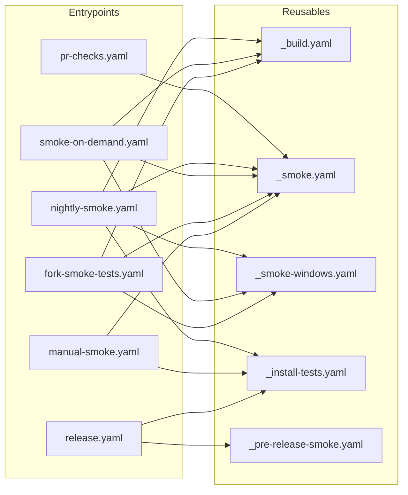
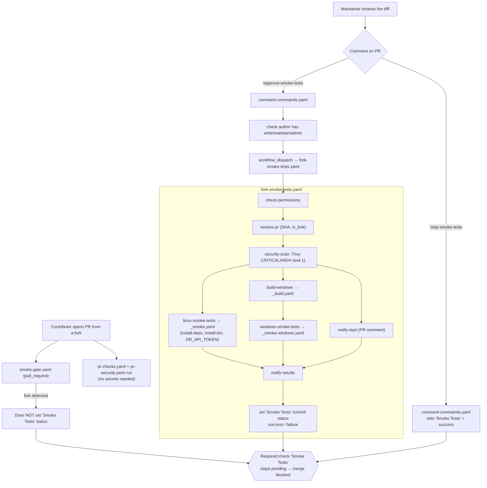
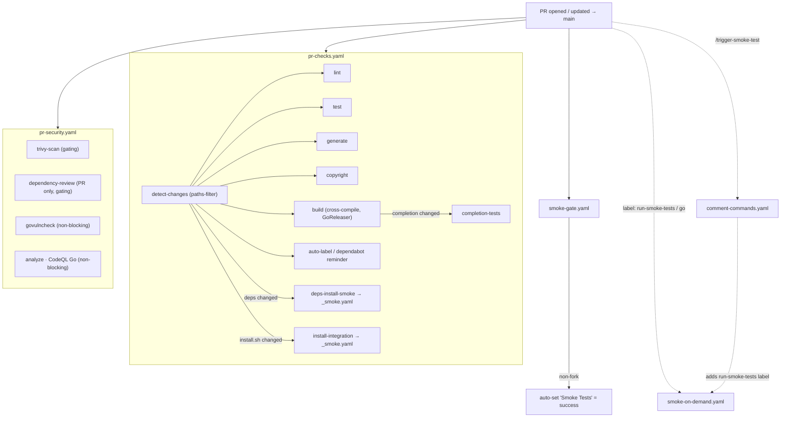
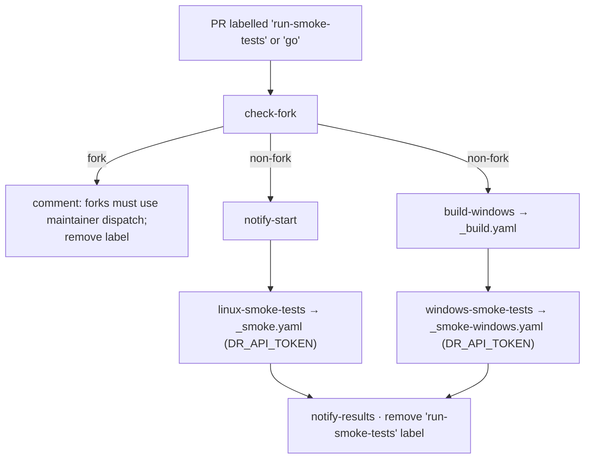
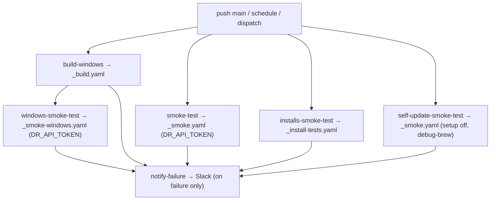
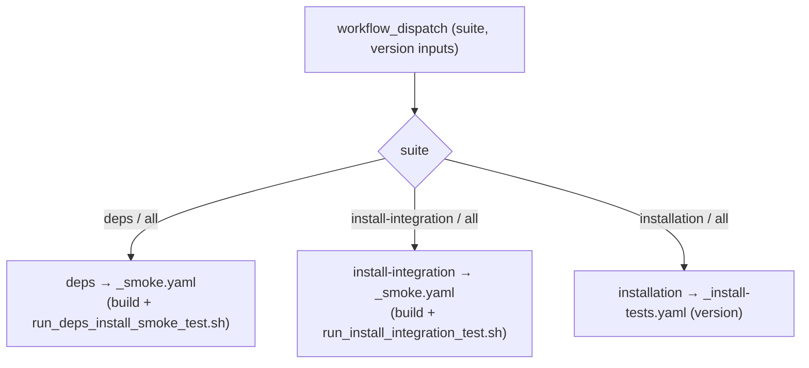
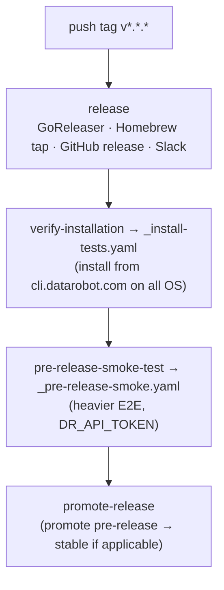
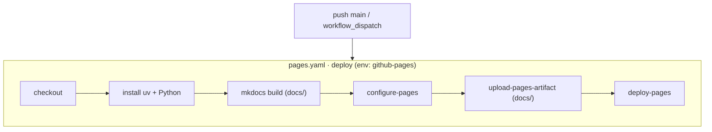

# CI/CD workflow flows (post Phase 4)

Reference diagrams for the restructured `.github/workflows/`. GitHub renders the
Mermaid blocks below natively — paste any of them into a PR description or issue.

Legend: solid arrows are job `needs:` dependencies; dotted arrows are optional /
user-triggered paths; `→ _x.yaml` means the job calls that reusable workflow.

---

## 0. Entrypoints → reusable building blocks

Which entrypoint calls which `_`-prefixed reusable.

---

## 1. Forked PR

A fork PR cannot use repo secrets, so the `Smoke Tests` required check is left
pending until a maintainer explicitly approves (runs) or skips it.

---

## 2. Regular PR (same-repo / maintainer)

`pr-checks` and `pr-security` run automatically; the gate auto-passes for
non-fork PRs. Full smoke tests are opt-in via a label or slash-command.

---

## 3. Smoke tests — on-demand (labelled, non-fork)

## 3b. Smoke tests — nightly / scheduled

Trigger: push to `main`, schedule (`0 */4 * * 1-5`), or manual dispatch.

## 3c. Smoke tests — manual dispatch (suite picker)

---

## 4. Release process

Trigger: push tag matching `v*.*.*` / `v*.*.*.*`.

---

## 5. Pages publication (Deploy static content to Pages)

Trigger: push to `main` or manual dispatch. Single `deploy` job in the
`github-pages` environment.

