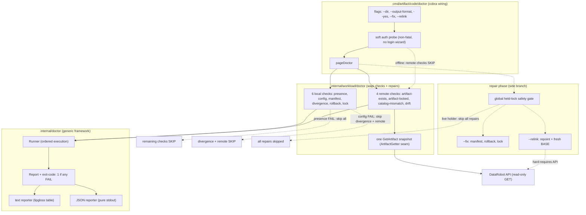
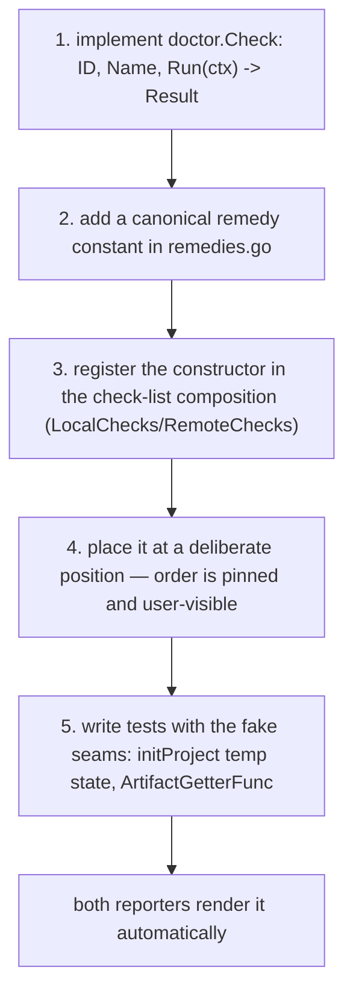

# `dr artifact code doctor` — Architecture & Check-Authoring Guide

Audience: CLI contributors

## Overview

`dr artifact code doctor` is a read-only diagnostic for a project's
`.datarobot/workload/` sync state. It inspects the local state — linked
artifact, `config.json`/`manifest.json` health, config/manifest agreement,
interrupted rollbacks, and the sync lock. If credentials resolve, it also
checks the linked artifact's remote health.

At the end it reports each check as `OK`, `WARN`, `FAIL`, or `SKIP` with a
concrete remedy for any issues.

Key invariants:

- **Read-only diagnosis.** Checks perform zero local writes and zero server
  writes. Only `--fix` and `--relink` write, and only to local state.
- **Exit-code contract.** `0` when no check `FAIL`s (`OK`/`WARN`/`SKIP`
  allowed); `1` when any check `FAIL`s; `1` on usage errors.
- **JSON purity.** With `--output-format json`, stdout is pure JSON; all
  warnings, prompts, and logs go to stderr.
- **Soft auth model.** Auth is probed non-fatally inside `RunE` (no
  `EnsureAuthenticatedE`, no login wizard, no `drconfig.yaml` write). Local
  checks always run; remote checks report `SKIP` with a connectivity/`dr auth
  login` remedy when the API is unreachable or unauthenticated. `--relink`
  is the exception — it must fetch the target artifact, so it hard-errors
  when the API is out of reach.

`--fix` runs safe local auto-repairs (rebuild the manifest from config,
restore an interrupted rollback, clear a stale lock) behind a global safety
gate that skips every repair while a live process holds the sync lock, then
re-runs the full check suite so the report and exit code reflect the post-fix
state. `--relink <new-artifact-id>` repoints the project at a different
artifact with a fresh sync baseline (empty BASE reset). `--fix` and `--relink`
are mutually exclusive.

## Architecture

The feature is layered in three packages. The command layer wires Cobra
flags and the soft auth probe; the workload layer owns the wapi-specific
checks and repairs; the generic framework layer owns the ordered runner, the
reporters, and exit-code aggregation. The generic layer imports nothing
about workload state, so a future top-level `dr doctor` can reuse it.

<!-- crap diagram, should be redone -->

The four remote checks share exactly one `GetArtifact` per run through the
injected `ArtifactGetter` seam (`remoteSnapshot` memoizes the fetch with
`sync.Once`), so a mid-run disappearance collapses to a single read. SKIP
cascades are honest per-run observations, not construction-time snapshots:
each check re-reads local state at `Run` time, so `wapi.presence` failing
makes every later check report `SKIP` ("no linked state"), and `wapi.config`
failing makes the divergence and all remote checks `SKIP` (no artifact id).
A `404` is owned solely by `remote.artifact-exists` (the only check allowed
to `FAIL` on one); the dependent remote checks `SKIP` rather than piling on.
Any non-`404` remote failure maps to `SKIP` with the connectivity remedy —
never a misleading `OK` and never `FAIL`-as-deleted.

## Adding your own check

The check suite is an ordered list of `doctor.Check` implementations built by
`Checks`/`LocalChecks`/`RemoteChecks` in `internal/workload/doctor`. A new
check is five small steps; both reporters pick it up automatically because
they render whatever the `Runner` returns.

Notes for check authors:

- **`Result` shape:** `{CheckID, Status, Summary, Remedy, Details, Fixable}`.
  `CheckID` is stamped by the `Runner` from `Check.ID()`, so do not set it
  yourself. `Details` is an optional `map[string]string` surfaced in JSON
  (e.g. `{"path": "/abs/file"}` for corrupt-file checks); omit it when nil.
- **Remedies are canonical.** Add exactly one remedy string per check
  condition in `remedies.go` and reuse it verbatim in both reporters — the
  command layer renders remedy strings as-is, never rewording them.
- **Check order is pinned and user-visible.** The six local checks run
  before the four remote checks, in the table order. New checks append at a
  deliberate position (the M4 extras append after the ticket-scope ten). Do
  not reorder existing checks without intent: IDs and order are part of the
  output contract.
- **Pure diagnostics.** A check `Run` must not mutate local state or make
  server writes. Repairs live behind `--fix`/`--relink` in the command layer.
- **Reuse the SKIP cascades.** Call `skipIfUnlinked` (and the
  `linkedConfig`/`fetchedArtifact` helpers for remote checks) so a missing
  precondition reports an honest `SKIP` instead of a misleading `FAIL`.
- **Test seams.** Use the existing `initProject`-style temp state and the
  `ArtifactGetterFunc` fake (no network). Inject a `GOOS` seam for any
  platform-specific behavior so it is unit-testable on any host.
