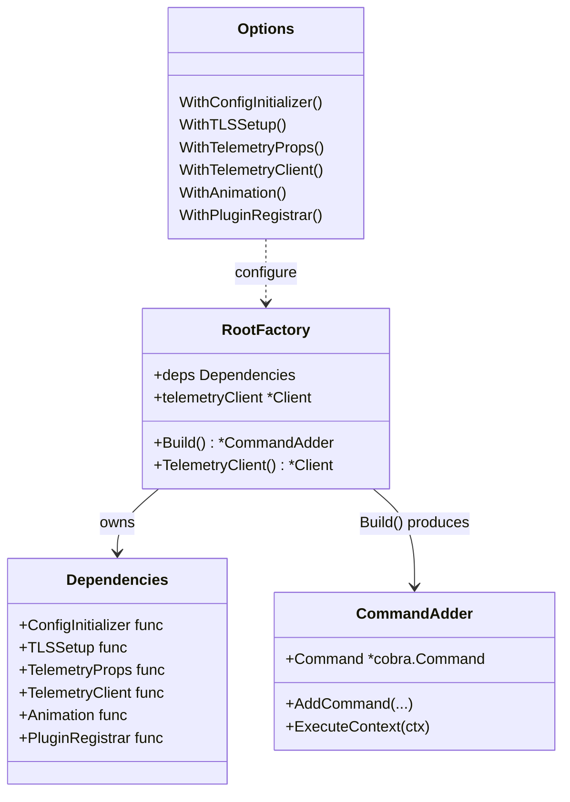
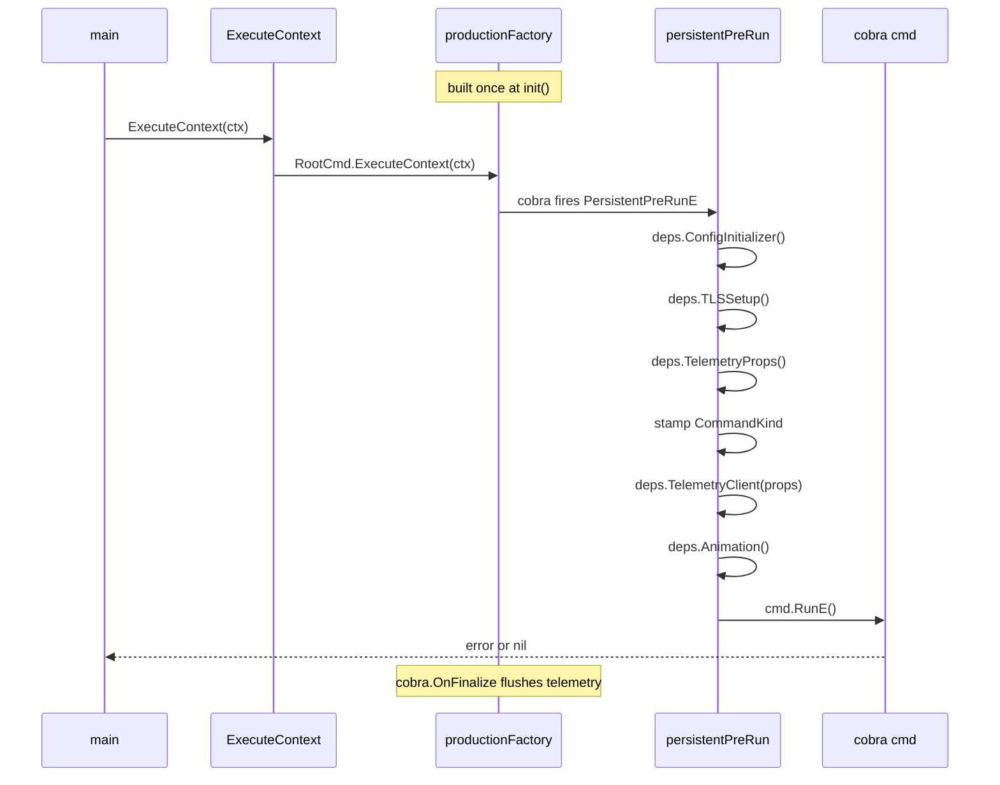
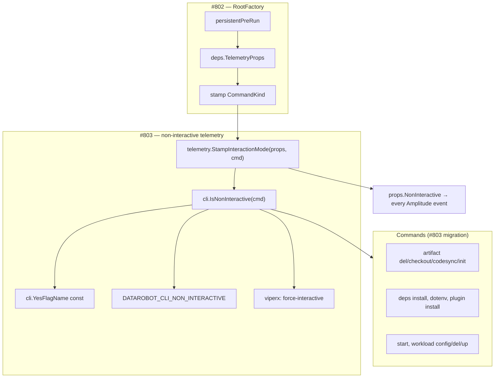

# Root Command Factory

## Overview

The `RootFactory` (`cmd/root_factory.go`) assembles the root cobra command from
injectable dependencies. Each call to `Build()` returns a fresh, fully-wired
`*cli.CommandAdder` with no shared mutable state — this is the key property that
prevents cross-test env-var leakage and lets tests run in isolation.

Production code (via `main`) uses the singleton built in `init()`. Tests use
`NewRootFactory(...)` directly with stubbed dependencies.

## Diagrams

### Factory structure



### Runtime sequence

How a command execution flows from `main` through the factory.



### How #803 extends the factory

`StampInteractionMode` and `IsNonInteractive` slot into the existing pre-run
hook. The factory is the only callsite — commands just read the result.



The key design point: **the factory is the single callsite for all pre-run
wiring**. `#802` defines the hook; `#803` inserts `StampInteractionMode` into it
and exports `IsNonInteractive` so commands never re-implement detection logic
themselves. Any future automation signal only needs to be wired in
`IsNonInteractive` — nothing else changes.

## Adding a new command

### 1. Register it

```go
// cmd/root_factory.go — addSubcommands()
func (f *RootFactory) addSubcommands(adder *cli.CommandAdder) {
    adder.AddCommand(
        // ...existing commands...
        myfeature.Cmd(),  // ← add it here
    )
}
```

### 2. Write the command

Commands have no knowledge of the factory. Same cobra pattern as always:

```go
// cmd/myfeature/cmd.go
package myfeature

func Cmd() *cobra.Command {
    c := &cobra.Command{
        Use:   "myfeature",
        Short: "Does the thing",
        RunE:  run,
    }

    telemetry.Track(c)  // wired once, fires automatically via cobra.OnFinalize

    return c
}

func run(cmd *cobra.Command, args []string) error {
    // config, TLS, and telemetry client are already set up by the factory's
    // PersistentPreRunE — nothing to initialize here
    return nil
}
```

### 3. Write a test

This is where the factory pays off. Previously you'd fight shared viperx state;
now you get a clean isolated tree:

```go
func TestMyFeatureCmd(t *testing.T) {
    root := cmd.NewRootFactory(
        cmd.WithConfigInitializer(func(_ *cobra.Command) error { return nil }),
        cmd.WithTLSSetup(func(_ *cobra.Command) error { return nil }),
        cmd.WithTelemetryProps(func() *telemetry.CommonProperties { return nil }),
        cmd.WithPluginRegistrar(func(_ *cobra.Command) {}),
        cmd.WithAnimation(func() {}),
    ).Build()

    var buf bytes.Buffer
    root.SetOut(&buf)
    root.SetArgs([]string{"myfeature"})

    require.NoError(t, root.Execute())
    assert.Contains(t, buf.String(), "expected output")
}
```

Once `newIsolatedRootCmd()` is available (from the test-isolation follow-up PR),
this reduces to:

```go
root := newIsolatedRootCmd()
root.SetArgs([]string{"myfeature"})
require.NoError(t, root.Execute())
```

**The short version:** commands are written identically to before — they return a
`*cobra.Command` from a `Cmd()` constructor, get registered in one place, and
know nothing about the factory. The factory only changes how tests and `main`
assemble the tree.

---

## Overriding a dependency in a test

The most common reason to override a dependency is preventing viperx state from
leaking between tests. When two tests both call `Execute()` on the same shared
`RootCmd` singleton, the first test's `t.Setenv(...)` can still be visible to
the second test via viper's global state — even after the env var is restored —
because `AutomaticEnv` re-reads the environment on the next access.

The fix is to give each test its own command tree built with a no-op
`ConfigInitializer` that never touches viper:

```go
func TestSomethingThatSetsEnvVars(t *testing.T) {
    t.Setenv("DATAROBOT_CLI_API_TOKEN", "test-token")

    // Without the factory: this env var could bleed into the next test
    // via viper's shared global state.
    //
    // With the factory: the no-op ConfigInitializer never calls
    // viperx.AutomaticEnv(), so viper never sees the env var at all.
    root := cmd.NewRootFactory(
        cmd.WithConfigInitializer(func(_ *cobra.Command) error {
            // Optionally seed specific viper keys your command needs,
            // without calling AutomaticEnv() or ReadConfigFile().
            viperx.Set("api-token", "test-token")
            return nil
        }),
        cmd.WithTLSSetup(func(_ *cobra.Command) error { return nil }),
        cmd.WithTelemetryProps(func() *telemetry.CommonProperties { return nil }),
        cmd.WithPluginRegistrar(func(_ *cobra.Command) {}),
        cmd.WithAnimation(func() {}),
    ).Build()

    root.SetArgs([]string{"mycommand"})
    require.NoError(t, root.Execute())
}
```

Similarly, override `WithTelemetryProps` to avoid hitting the network or disk
for device/user IDs, and `WithPluginRegistrar` to skip filesystem discovery:

```go
// Minimal no-op factory — safe for any unit test.
root := cmd.NewRootFactory(
    cmd.WithConfigInitializer(func(_ *cobra.Command) error { return nil }),
    cmd.WithTLSSetup(func(_ *cobra.Command) error { return nil }),
    cmd.WithTelemetryProps(func() *telemetry.CommonProperties { return nil }),
    cmd.WithPluginRegistrar(func(_ *cobra.Command) {}),
    cmd.WithAnimation(func() {}),
).Build()
```

> **Why not just use the global `RootCmd`?** The global singleton is built once
> in `init()` with the production `ConfigInitializer`. Every `Execute()` call on
> it runs `viperx.AutomaticEnv()` and `ReadConfigFile()` against the live
> environment. Env vars set with `t.Setenv()` are restored after the test, but
> viper's internal cache may retain values until the next `AutomaticEnv()` sweep
> — which happens in the *next* test's `Execute()`. A fresh factory tree sidesteps
> this entirely.

---

## Adding a new dependency to the factory

Follow these four steps whenever a new cross-cutting concern needs to be
injectable (for example, a new HTTP client, a feature-flag provider, or an
audit logger).

### Step 1 — Define the function type

Add a named function type to the top of `root_factory.go`. Named types make
option signatures self-documenting and prevent callers from accidentally passing
the wrong function:

```go
// AuditLoggerFunc writes an audit event for the current command invocation.
// Replace in tests with a no-op or a recorder.
type AuditLoggerFunc func(cmd *cobra.Command, args []string) error
```

### Step 2 — Add the field to `Dependencies`

```go
type Dependencies struct {
    ConfigInitializer ConfigInitializerFunc
    TLSSetup          TLSSetupFunc
    // ... existing fields ...

    // AuditLogger writes an audit event before each command runs.
    AuditLogger AuditLoggerFunc
}
```

### Step 3 — Set the production default and add a `With*` option

```go
func DefaultDependencies() Dependencies {
    return Dependencies{
        // ... existing defaults ...
        AuditLogger: defaultAuditLogger,
    }
}

// WithAuditLogger overrides the audit-logging step.
// Pass a no-op in tests that don't need audit coverage.
func WithAuditLogger(fn AuditLoggerFunc) Option {
    return func(f *RootFactory) {
        f.deps.AuditLogger = fn
    }
}
```

### Step 4 — Call it in the right factory method

Most new dependencies belong in `persistentPreRun` (runs before every command)
or `addSubcommands` (runs once at build time). For something like an audit
logger that needs to fire before each command:

```go
func (f *RootFactory) persistentPreRun(cmd *cobra.Command, args []string) error {
    // ... existing setup ...

    if err := f.deps.AuditLogger(cmd, args); err != nil {
        return err
    }

    return nil
}
```

That's it. Tests override it with `WithAuditLogger(func(...) error { return nil })`;
production gets `defaultAuditLogger` for free.

---

## Feature-gating a command

Feature gates hide commands behind an environment variable until they are ready
for release. The factory's `addSubcommands` uses `cli.CommandAdder.AddCommand`,
which automatically drops any command whose gate is not enabled.

### Gate a top-level command

```go
// cmd/myfeature/cmd.go
func Cmd() *cobra.Command {
    c := &cobra.Command{
        Use:   "myfeature",
        Short: "Coming soon",
    }

    // Gate this command behind DATAROBOT_CLI_FEATURE_MYFEATURE=true.
    features.SetGate(c, "myfeature")

    return c
}
```

Register it normally in `addSubcommands` — `CommandAdder` handles the filtering:

```go
adder.AddCommand(
    myfeature.Cmd(),  // silently dropped unless the gate is enabled
)
```

### Gate a nested subcommand

`CommandAdder.AddCommand` only filters at the level it's called from. To gate a
subcommand inside an existing parent, wrap the parent with `CommandAdder`:

```go
func Cmd() *cobra.Command {
    parent := &cobra.Command{Use: "parent"}
    adder := &cli.CommandAdder{Command: parent}

    adder.AddCommand(gatedChild.Cmd())  // dropped when gate is off

    return parent
}
```

### Enable a gate locally

```sh
DATAROBOT_CLI_FEATURE_MYFEATURE=true dr myfeature
```

The env var name is derived from the gate name: uppercased, hyphens replaced
with underscores, prefixed with `DATAROBOT_CLI_FEATURE_`.

### Test gated and ungated behaviour

Because gate evaluation happens in `init()` (when the production `RootCmd` is
built), tests that check for command presence or absence should use the fresh
factory tree — or skip when the gate state doesn't match what the test expects:

```go
func TestMyFeatureHiddenByDefault(t *testing.T) {
    // Build a fresh tree with no feature gate enabled.
    root := cmd.NewRootFactory(
        cmd.WithConfigInitializer(func(_ *cobra.Command) error { return nil }),
        cmd.WithTLSSetup(func(_ *cobra.Command) error { return nil }),
        cmd.WithTelemetryProps(func() *telemetry.CommonProperties { return nil }),
        cmd.WithPluginRegistrar(func(_ *cobra.Command) {}),
        cmd.WithAnimation(func() {}),
    ).Build()

    for _, sub := range root.Commands() {
        assert.NotEqual(t, "myfeature", sub.Name(),
            "myfeature should not be present when gate is disabled")
    }
}

func TestMyFeatureVisibleWhenGateEnabled(t *testing.T) {
    t.Setenv("DATAROBOT_CLI_FEATURE_MYFEATURE", "true")

    root := cmd.NewRootFactory( /* same no-op deps */ ).Build()

    var found bool
    for _, sub := range root.Commands() {
        if sub.Name() == "myfeature" {
            found = true
        }
    }

    assert.True(t, found, "myfeature should be present when gate is enabled")
}
```
