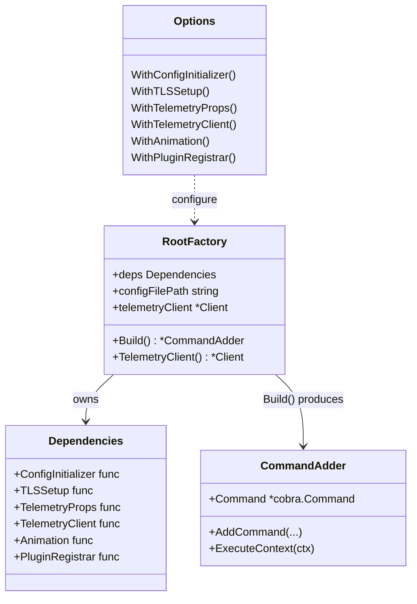
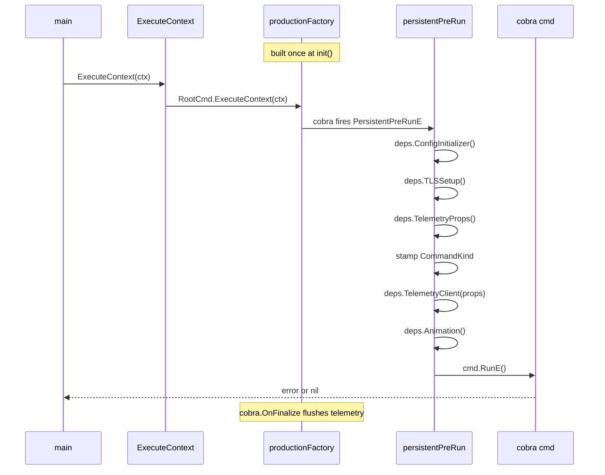
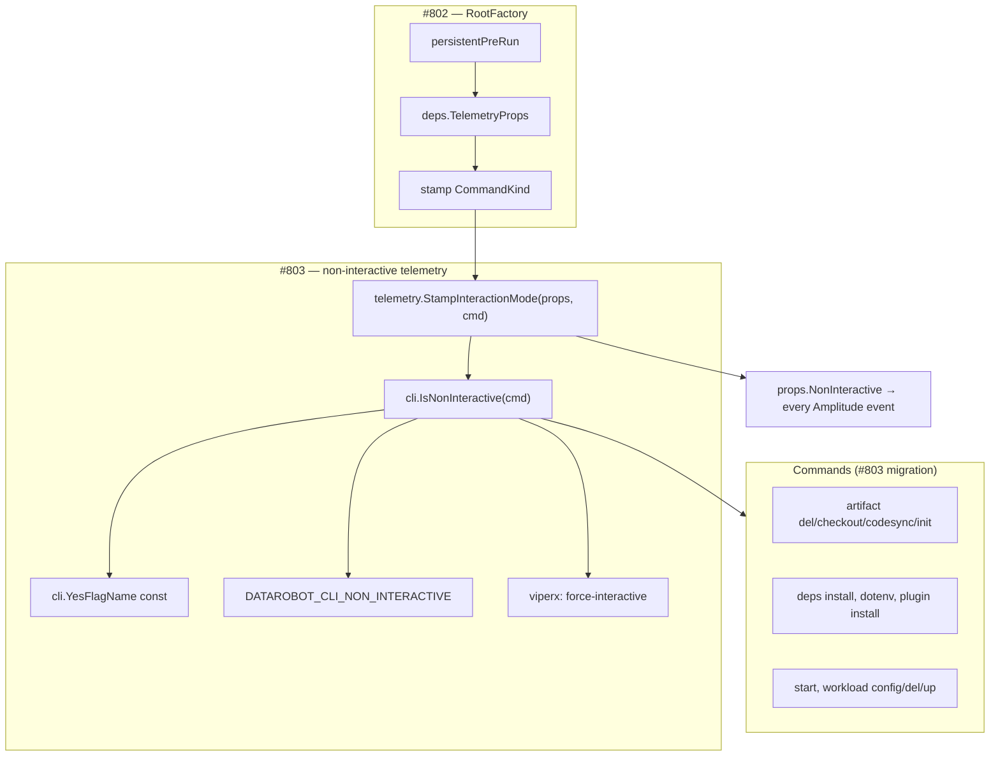

# Root Command Factory

## Overview

The `RootFactory` (`cmd/root_factory.go`) assembles the root cobra command from
injectable dependencies. Each call to `Build()` returns a fresh, fully-wired
`*cli.CommandAdder` with no shared mutable state — this is the key property that
prevents cross-test env-var leakage and lets tests run in isolation.

Production code (via `main`) uses the singleton built in `init()`. Tests use
`NewRootFactory(...)` directly with stubbed dependencies.

## Diagrams

### Factory structure



### Runtime sequence

How a command execution flows from `main` through the factory.



### How #803 extends the factory

`StampInteractionMode` and `IsNonInteractive` slot into the existing pre-run
hook. The factory is the only callsite — commands just read the result.



The key design point: **the factory is the single callsite for all pre-run
wiring**. `#802` defines the hook; `#803` inserts `StampInteractionMode` into it
and exports `IsNonInteractive` so commands never re-implement detection logic
themselves. Any future automation signal only needs to be wired in
`IsNonInteractive` — nothing else changes.

## Adding a new command

### 1. Register it

```go
// cmd/root_factory.go — addSubcommands()
func (f *RootFactory) addSubcommands(adder *cli.CommandAdder) {
    adder.AddCommand(
        // ...existing commands...
        myfeature.Cmd(),  // ← add it here
    )
}
```

### 2. Write the command

Commands have no knowledge of the factory. Same cobra pattern as always:

```go
// cmd/myfeature/cmd.go
package myfeature

func Cmd() *cobra.Command {
    c := &cobra.Command{
        Use:   "myfeature",
        Short: "Does the thing",
        RunE:  run,
    }

    telemetry.Track(c)  // wired once, fires automatically via cobra.OnFinalize

    return c
}

func run(cmd *cobra.Command, args []string) error {
    // config, TLS, and telemetry client are already set up by the factory's
    // PersistentPreRunE — nothing to initialize here
    return nil
}
```

### 3. Write a test

This is where the factory pays off. Previously you'd fight shared viperx state;
now you get a clean isolated tree:

```go
func TestMyFeatureCmd(t *testing.T) {
    root := cmd.NewRootFactory(
        cmd.WithConfigInitializer(func(_ *cobra.Command, _ string) error { return nil }),
        cmd.WithTLSSetup(func(_ *cobra.Command) error { return nil }),
        cmd.WithTelemetryProps(func() *telemetry.CommonProperties { return nil }),
        cmd.WithPluginRegistrar(func(_ *cobra.Command) {}),
        cmd.WithAnimation(func() {}),
    ).Build()

    var buf bytes.Buffer
    root.SetOut(&buf)
    root.SetArgs([]string{"myfeature"})

    require.NoError(t, root.Execute())
    assert.Contains(t, buf.String(), "expected output")
}
```

Once `newIsolatedRootCmd()` is available (from the test-isolation follow-up PR),
this reduces to:

```go
root := newIsolatedRootCmd()
root.SetArgs([]string{"myfeature"})
require.NoError(t, root.Execute())
```

**The short version:** commands are written identically to before — they return a
`*cobra.Command` from a `Cmd()` constructor, get registered in one place, and
know nothing about the factory. The factory only changes how tests and `main`
assemble the tree.
